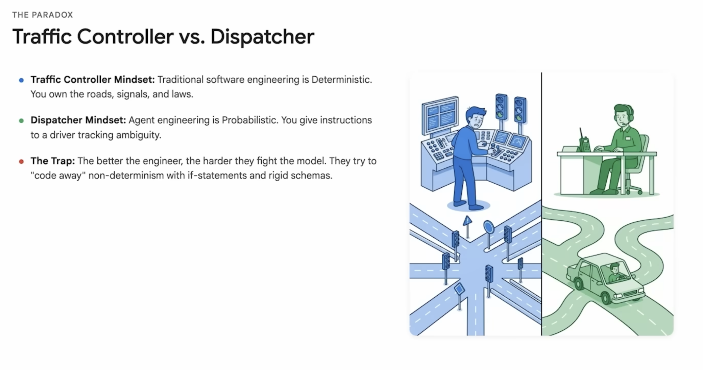
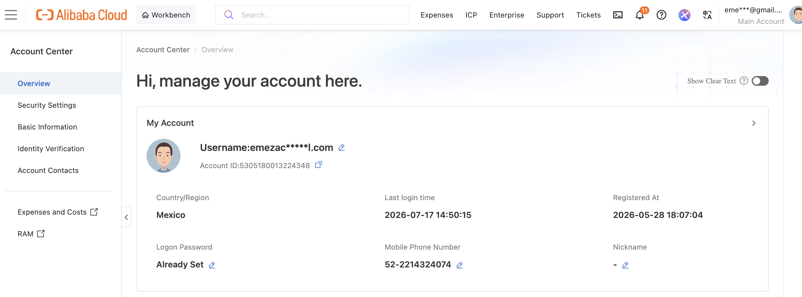
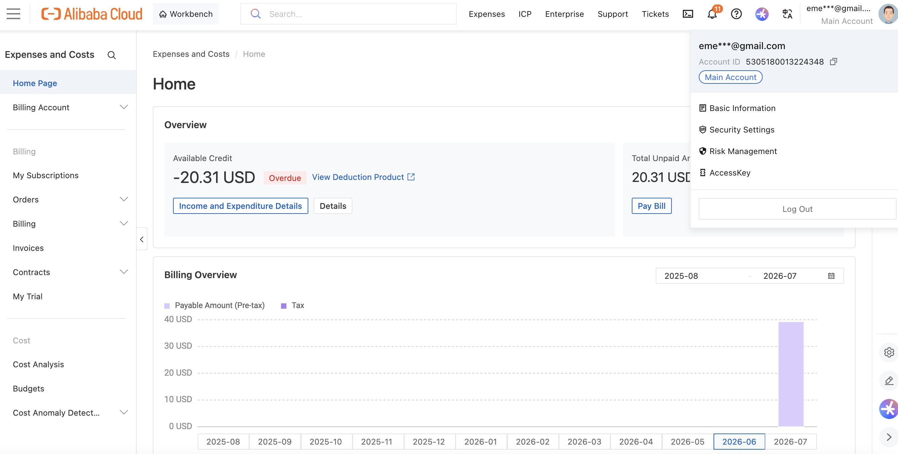
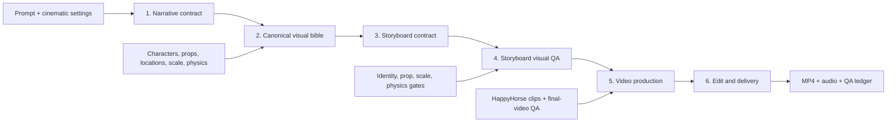

# Showrunner

Showrunner is a consistency-first AI production system for short films. It turns a story prompt into a validated screenplay, a canonical visual bible, a shot-by-shot storyboard, generated video clips, audio, and an assembled final cut.

The application is generic: it is not tied to the foosball demo or to fictional characters. Its contracts are designed to preserve identity, scale, props, locations, spatial continuity, and physical behavior across any project, including stories with human performers.

This is an experimental hackathon project. It calls paid external generative services, and model output remains probabilistic. Showrunner reduces that uncertainty with explicit contracts, reference media, quality gates, bounded repair, and operator controls; it cannot make every provider generation deterministic.

## Proof of Deployment

The following Qwen Cloud screenshots provide the deployment evidence required for the hackathon submission:

| Evidence | Qwen Cloud deployment proof |
| --- | --- |
| Proof 1 | [Open `proof1.png`](proof1.png) |
| Proof 2 | [Open `proof2.png`](proof2.png) |
| Proof 3 | [Open `proof3.png`](proof3.png) |

<details>
<summary>Preview deployment evidence</summary>

### Proof 1



### Proof 2



### Proof 3



</details>

## What the application does

1. Accepts a story prompt and cinematic configuration.
2. Checks the source for contradictions and extracts non-negotiable facts.
3. Forecasts token consumption before production and lets the operator approve a predicted overrun.
4. Builds a screenplay and canonical visual bible for characters, props, locations, scale, and physics.
5. Compiles every shot from those canonical facts instead of prompting each image independently.
6. Generates reference assets and storyboard keyframes.
7. Measures storyboard identity, prop, scale, and physics fidelity.
8. Regenerates selected assets, shots, or scenes without silently changing unrelated work.
9. Produces video clips, performs final-video QA, applies at most one bounded automatic repair pass, and assembles a final MP4 with audio.

The main UI is available at `/projects`; the live architecture reference and system diagram are at `/architecture`.

## Operating modes

| UI mode | Internal value | Behavior |
| --- | --- | --- |
| Automatic | `agentic` | Resolves unspecified cinematic defaults, advances the workflow automatically, and can perform one bounded repair pass before final assembly. |
| Full Control | `control` | Exposes approval, targeted regeneration, QA retry, token-overrun, and render controls. An operator may accept a **visual-only** QA risk for the requested render. Script-contract and source-to-asset failures remain blocking. |

Full Control means that an explicit operator command is honored at the requested scope. Regenerating one character, shot, or scene must not restart the entire production. Automatic mode instead chooses safe defaults and attempts to finish the complete film without requiring every intermediate decision.

## Production pipeline



### 1. Narrative contract

`ScriptConsistencyValidator`, `SourceProfileExtractor`, `ScreenplayEvaluator`, and `PreproductionCheckpoint` normalize the input, detect contradictions, preserve source facts, and stop structurally invalid plans before visual generation. `ProductionTokenPredictor` estimates narrative, asset, storyboard, visual-QA, repair, and final-video-QA consumption from the requested duration, complexity, cinematic choices, and historical render data.

### 2. Canonical visual bible

`AssetProfiler` and `ProductionBible` create stable descriptions and reference prompts for every recurring character, prop, and location. `ScaleContractResolver` records relative dimensions and miniature/real-world class. `CanonicalMediaStore` immediately persists provider-hosted reference images so expiring signed URLs never become the source of truth.

Technical calibration sheets may be used by QA, but they are marked as non-narrative media and are never eligible as storyboard frames or final-video inputs.

### 3. Storyboard contract

`ScreenplayPlanner`, `ContinuityPlanner`, `ContinuityPlatePlanner`, and `StoryboardPromptCompiler` translate each scene into atomic shots. Each compiled prompt receives the same canonical identity, wardrobe, material, scale, prop, location, lighting, screen-direction, and physical-state constraints. Creativity remains available for framing, lens, movement, pacing, and other filmic choices that do not break continuity.

### 4. Storyboard visual QA

`VisualConsistencyEvaluator` evaluates generated keyframes against canonical references. A storyboard passes at `85/100` only when the relevant dimensions also pass their individual floors:

- Identity: `85`
- Recurring props: `85`
- Scale and dimensionality: `90`
- Physics and physical constraints: `85`

A high average cannot hide a failed scale or identity dimension. Failed shot IDs are retained for targeted review and regeneration. `ConsistencyEvaluator`, `AssetFidelityEvaluator`, and `ConsistencyOverridePolicy` combine structural, script, source-to-asset, and visual results into the visible Consistency Gate.

### 5. Video production

`ProduceDramaJob` claims the production run, renders shot clips through `VideoSynth` and `HappyHorseClient`, publishes progress through Action Cable, and runs `VideoConsistencyEvaluator` on sampled video frames. Automatic repair is bounded to prevent an infinite “repair, rerender, discover new failures” loop. Existing accepted clips and durable references are reused whenever possible.

### 6. Edit and delivery

`AudioDirector` resolves the configured narration, music, and audio defaults. `Editor` normalizes clips and uses FFmpeg to assemble the final cut. The final artifact is rejected if mandatory audio is absent. Debug captions, prompt labels, calibration grids, and QA-only media are excluded from production inputs.

## Consistency and recovery rules

- The screenplay is the narrative source of truth.
- The production bible is the visual source of truth.
- Provider URLs are transient transport, never durable identity references.
- Script and source-to-asset failures cannot be overridden.
- In Full Control, an operator can explicitly accept remaining visual-only risk for one render.
- Automatic repair is limited and records what it attempted.
- Manual regeneration remains available when the gate is blocked.
- A one-shot token-overrun authorization applies only to the next eligible operation and includes its required QA.
- UI copilot usage is accounted separately from production planning and rendering.
- Failed and partial QA states remain visible; they are not presented as successful measurements.

## Architecture

The web process owns requests, validation, project state, controls, and live UI updates. Sidekiq owns long-running planning and rendering. PostgreSQL stores projects, manifests, shots, timing history, ledgers, and AgentKit memory. Redis backs Sidekiq and Action Cable. External Qwen and HappyHorse services provide language, vision, image, and video generation. FFmpeg/ffprobe handle local media inspection and final assembly.

Key components:

| Layer | Components |
| --- | --- |
| Web and orchestration | `ProjectsController`, `ShowrunnerAgent`, `ProduceDramaJob`, `ProductionModePolicy` |
| Narrative | `ScriptConsistencyValidator`, `SourceProfileExtractor`, `ScreenplayPlanner`, `ScreenplayEvaluator`, `PreproductionCheckpoint` |
| Visual bible | `AssetProfiler`, `ProductionBible`, `ScaleContractResolver`, `AssetFidelityEvaluator` |
| Storyboard | `ContinuityPlanner`, `ContinuityPlatePlanner`, `StoryboardPromptCompiler`, `StoryboardRegenerator` |
| Quality gates | `ConsistencyEvaluator`, `VisualConsistencyEvaluator`, `VideoConsistencyEvaluator`, `ConsistencyOverridePolicy` |
| Media | `CanonicalMediaStore`, `StableMedia`, `VideoSynth`, `AudioDirector`, `Editor` |
| Providers | `QwenRouter`, `HappyHorseClient` |

The implementation-level diagram, state transitions, failure paths, control-mode rules, and runtime contract are rendered by the application at [`/architecture`](http://localhost:5000/architecture).

## Durable media model

Generated provider URLs can expire. Showrunner downloads canonical and storyboard images while they are valid and stores them as content-addressed files under:

```text
public/generated/projects/<project_id>/media/<sha256>.<ext>
```

The store validates PNG, JPEG, and WebP signatures, limits image payloads to 20 MB, rejects unsafe/private redirect targets, and deduplicates byte-identical content. The database stores stable local references, not base64 blobs. A local image is converted to a data URI only at a provider boundary that requires one.

Final films and their QA ledgers are written to:

```text
public/dramas/drama_<project_id>.mp4
public/dramas/drama_<project_id>.mp4.ledger.json
```

`public/generated` is intentionally ignored by Git. Local disk is currently the durable media backend; a multi-instance deployment should replace it with shared object storage and backups.

## Technology stack

- Ruby `3.4.1`
- Rails `8.1.3`
- PostgreSQL with the `pgvector` extension
- Redis, Sidekiq, and sidekiq-cron
- Turbo, Stimulus, Action Cable, and import maps
- Qwen OpenAI-compatible language/vision APIs
- DashScope image generation and HappyHorse video synthesis
- FFmpeg and ffprobe
- AgentKit Rails plus local agent/workflow libraries

## Requirements

Install the following before booting the application:

- Ruby `3.4.1` and Bundler
- PostgreSQL with `pgvector`
- Redis on `localhost:6379`, or a configured `REDIS_URL`
- FFmpeg with ffprobe available on `PATH`
- A Qwen/DashScope API credential for non-dry-run production

Redis must be running **before Rails boots**. The Sidekiq scheduling integration is loaded during application initialization, so commands such as `bin/rails routes`, database tasks, the web server, and tests can fail early when Redis is unavailable.

## Configuration

Copy the environment template and replace its placeholder credential:

```bash
cp .env.example .env
```

Important variables:

| Variable | Required | Purpose |
| --- | --- | --- |
| `QWEN_TOKEN` | Yes for online generation | Shared credential for Qwen and HappyHorse. `DASHSCOPE_API_KEY` is accepted as a fallback. |
| `QWEN_BASE_URL` | No | OpenAI-compatible Qwen endpoint. |
| `QWEN_MODEL` | No | Default language model. Stage-specific `QWEN_MODEL_<STAGE>` overrides are supported. |
| `QWEN_VISION_MODEL` | No | Vision model used by QA. |
| `DASHSCOPE_HOST` | No | Native DashScope host for image/video jobs. |
| `HAPPYHORSE_MODEL` | No | Video synthesis model. |
| `CONSISTENCY_STRICT` | No | When `true`, blocks assembly if mandatory clip-level visual QA remains unavailable or failed. |
| `REDIS_URL` | No | Redis URL for Action Cable; local default is `redis://localhost:6379/1`. |
| `PORT` | No | Web port; Rails defaults to `3000`. Use `5000` to match the demo URLs in this README. |
| `CUATRO_DATABASE_PASSWORD` | Production | Password for the production PostgreSQL databases. |

Never commit `.env`. If a real provider key has appeared in a commit, log, screenshot, chat, or ticket, rotate it before continuing.

## Local setup

Start PostgreSQL and Redis first. On macOS with Homebrew, for example:

```bash
brew services start postgresql
brew services start redis
```

Then install dependencies and prepare the database:

```bash
bundle install
bin/rails db:prepare
```

Optional demo data can be loaded with:

```bash
bin/rails db:seed
```

The seed creates a sample dry-run project. It is demonstration data, not part of the production pipeline contract.

## Running the application

Run all development processes with Foreman:

```bash
PORT=5000 bin/dev
```

This starts:

- Rails web server
- Sidekiq worker
- Redis server

If Redis is already managed by Homebrew or another service, avoid starting a second process on the same port. Run the web and worker separately instead:

```bash
PORT=5000 bin/rails server
bundle exec sidekiq -C config/sidekiq.yml
```

Open:

- Projects: [http://localhost:5000/projects](http://localhost:5000/projects)
- Architecture: [http://localhost:5000/architecture](http://localhost:5000/architecture)
- Health check: [http://localhost:5000/up](http://localhost:5000/up)

After changing job or service code, restart Sidekiq. A running worker keeps the Ruby classes it loaded at boot.

## Using the product

1. Create a project from the dashboard.
2. Enter the story prompt, duration, resolution, audience, cinematic direction, and operating mode.
3. Review the token forecast. Increase the base budget or explicitly approve the predicted excess when appropriate.
4. Submit the project. Planning runs asynchronously and live progress appears in the UI.
5. Review the screenplay and consistency findings.
6. Review or regenerate character, prop, and location references.
7. Review storyboard frames and the Consistency Gate.
8. In Full Control, regenerate a specific asset, shot, or scene, retry visual QA, or explicitly accept remaining visual-only risk.
9. Approve rendering. The worker generates clips, audits final video, applies any allowed bounded repair, adds audio, and publishes the final MP4.

`dry_run` projects execute the pipeline without Qwen or HappyHorse network generation and use local fallback media. They are useful for workflow development, not for judging provider visual quality.

## Testing and quality checks

Redis and PostgreSQL must be available before the Rails test environment boots.

Run the complete suite:

```bash
bin/rails test
```

Run focused service and integration tests during pipeline work:

```bash
bin/rails test test/services
bin/rails test test/jobs/produce_drama_job_test.rb
bin/rails test test/controllers/projects_controller_test.rb
```

Static checks:

```bash
bin/rubocop
bin/brakeman --no-pager
bin/bundler-audit
```

High-risk changes should be tested in both `agentic` and `control` modes, with and without token-overrun authorization, and with provider failures or partial QA results.

## Operational behavior

- Planning and rendering are asynchronous; a successful HTTP request does not mean the background job has finished.
- Project status and manifest checkpoints are persisted so refreshes do not erase progress.
- Job claims prevent duplicate production runs from spending credits concurrently.
- Token budget and image/video provider credits are separate constraints.
- Overrun approval permits additional tokens; it does not create provider image/video credits.
- Provider timeouts and malformed downloads are reported as failures rather than silently accepted.
- A recoverable final cut can remain pending review when strict QA blocks publication.
- Action Cable updates the visible status, but the database is the authoritative state after reconnecting.

## Known limitations

- Generative models can still vary identity, anatomy, scale, motion, or lighting; difficult physical relationships may require targeted regeneration.
- The current media backend is local disk and is not suitable for horizontally scaled production without shared storage.
- The application depends on external provider availability, quotas, model behavior, and signed-media lifetimes.
- QA quality depends on the configured vision model and on valid canonical reference images.
- Automatic repair is intentionally bounded. The system favors a visible, actionable failure over an unbounded credit-consuming loop.
- The hackathon UI assumes a local/default user rather than a complete production authentication and tenancy system.

## Repository map

```text
app/agents/                  Showrunner planning orchestration
app/controllers/             Project UI, controls, forecasting, and regeneration
app/jobs/                    Long-running production job
app/services/                Contracts, visual bible, QA, continuity, media, and policy
app/views/projects/          Dashboard, project workflow, and architecture page
app/javascript/controllers/  Stimulus interactions and live UI behavior
lib/qwen_router.rb            Qwen language/vision adapter
lib/happy_horse_client.rb     DashScope image/video adapter
lib/showrunner.rb             Rendering, audio, and FFmpeg pipeline
public/generated/             Durable generated media (Git-ignored)
public/dramas/                Final MP4 files and QA ledgers
test/                         Unit, service, job, and controller coverage
```

## Hackathon presentation material

- `doc/speech.txt`: two-minute architecture explanation aligned with `/architecture`.
- `doc/speech2.txt`: two-minute end-to-end UI and operating-flow explanation.
